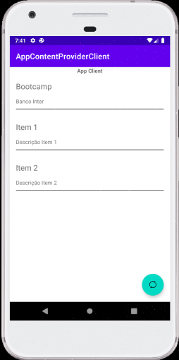

# AppContentProviderClient

App Android que exibe os itens disponibilizados pelo outro app através de Content Provider. 

Obs: Necessário acessar o projeto [AppContentProvider](https://github.com/guilhermereisdev/AppContentProvider) para criar os itens para serem disponibilizados.

#### Screenshots

